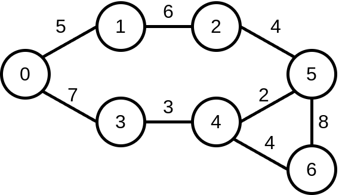
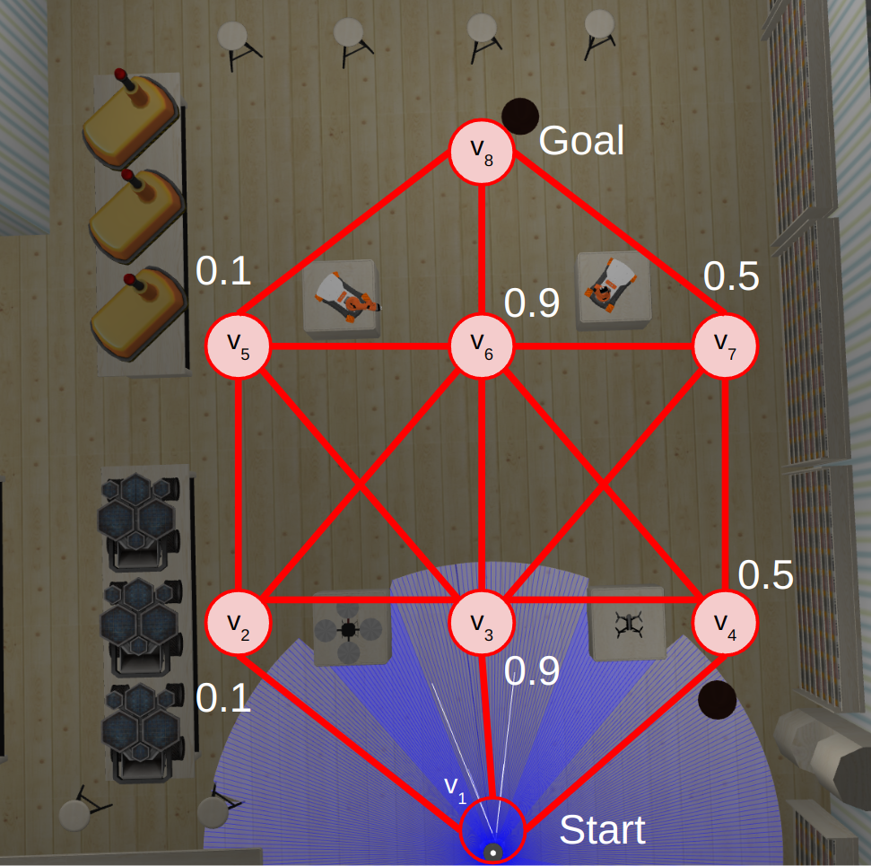
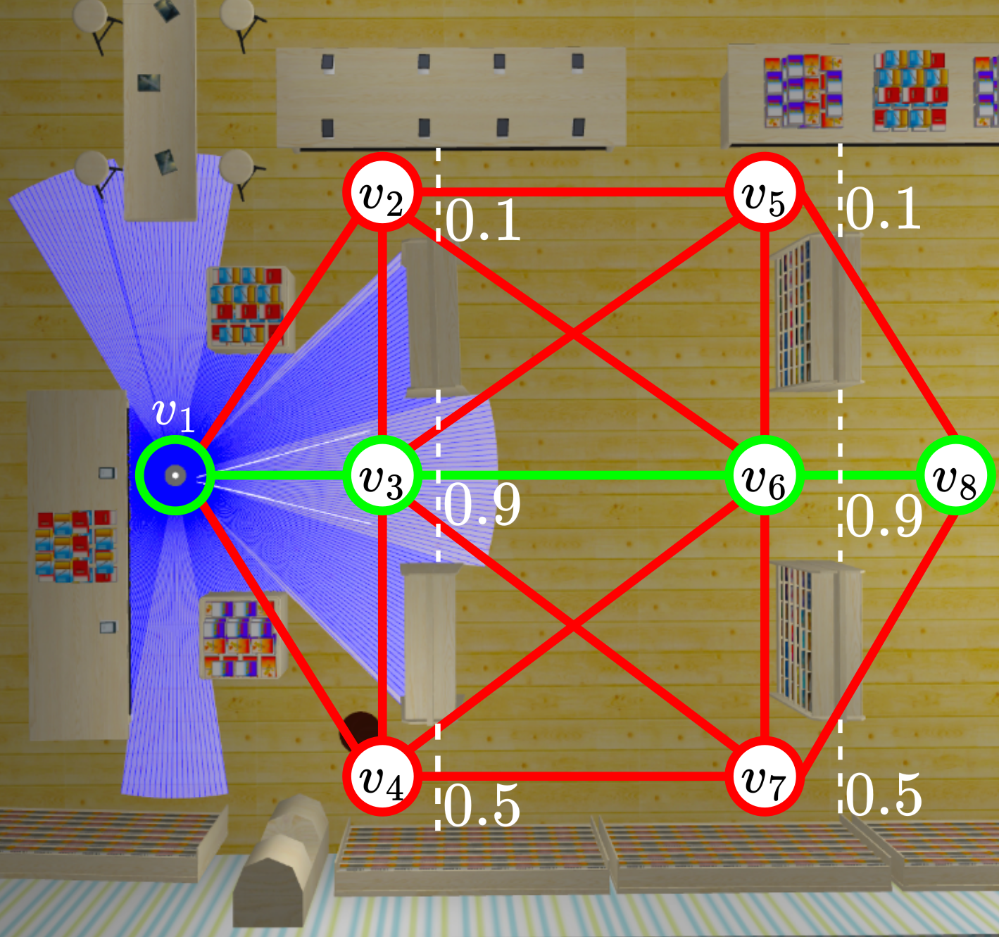

Tutorials
=========

How to synthesise a refined BT from a set of options
----------------------------------------------------

For this tutorial, we will consider a basic graph search problem, where robot actions
are navigation actions along edges.

The source code for this tutorial can be found `here <https://github.com/convince-project/refine-plan/blob/main/bin/graph_example.py>`__.

Consider the following undirected graph, where values along edges represent the cost of traversal:

|Graph|

Let's say that we want to synthesise a BT which navigates the robot to node 5 along the shortest path.
For an edge (v,v'), the robot reaches v' with probability 0.7. The remainder of the probability is uniformly distributed among the other possible successors from v.
The expected cost of edge (v,v') is the weighted average cost according to the edge weights and transition probabilities.

**In this tutorial, we will construct an option for each edge action, and use this to synthesise a BT.**

We begin by importing all necessary code from ``refine_plan``. We will cover these imports throughout the tutorial.

.. code-block:: python

    from refine_plan.algorithms.refine import synthesise_bt_from_options
    from refine_plan.models.condition import Label, EqCondition
    from refine_plan.models.state_factor import IntStateFactor
    from refine_plan.models.option import Option

Our first step in building the options is to define our state space.
We do this by defining a *state factor* which capture the robot's current node.
In this instance, the nodes are integers, and so we create an ``IntStateFactor`` called ``node_sf`` which can take values 0 through 6 inclusive.

.. code-block:: python

    # Step 1: Build our state factor for the graph
    # The state factor captures the robot's current node
    node_sf = IntStateFactor("node_sf", 0, 6)

To define the probabilistic transitions and reward function, we must now capture the connectivity of the above graph.
This can be achieved through a nested dictionary:

.. code-block:: python

    # Step 2: Define the connectivity of our graph as a dictionary
    # graph[v][v'] = cost
    graph = {
        0: {1: 5, 3: 7},
        1: {0: 5, 2: 6},
        2: {1: 6, 5: 4},
        3: {0: 7, 4: 3},
        4: {3: 3, 5: 2, 6: 4},
        5: {2: 4, 4: 2, 6: 8},
        6: {4: 4, 5: 8},
    }

With the graph and our state space defined, we can now compute the probabilistic transitions and 
rewards. In ``refine_plan``, we define these using *conditions*.

For this graph search example, we use ``EqConditions``, or equality conditions. These conditions are 
satisfied when a state holds a particular value for a state factor.

With this, we represent probabilistic transitions as a (pre-condition, probabilistic post-conditions) pair.
The pre-condition defines the states where this edge/option can be navigated.
The probabilistic post-conditions is a dictionary from post-condition to probability.
This defines the effects of an edge/option, and the probability of these effects.

We can compute these transitions as follows:

.. code-block:: python

    # Step 3: Define our transition function for an edge
    # We say that for edge (v,v') there is a 0.7 chance of reaching v
    # and a 0.3 chance of that being split evenly across the other possible successor nodes
    def trans_probs(src, dst):
        """Compute a (pre_cond, prob_post_conds) pair for a given edge.

        pre_cond is the guard for an edge.
        prob_post_conds is a dictionary from post conditions to probabilities

        Args:
            src: The start node of an edge
            dst: The destination node of an edge

        Returns:
            A (pre_cond, prob_post_conds) pair
        """
        pre_cond = EqCondition(node_sf, src)
        prob_post_conds = {}

        for succ in graph[src]:
            post_cond = EqCondition(node_sf, succ)
            prob = 0.7 if succ == dst else 0.3 / (len(graph[src]) - 1.0)
            prob_post_conds[post_cond] = prob

        return (pre_cond, prob_post_conds)

The rewards can be computed in a similar way. In ``refine-plan``, rewards for an edge/option are given as a 
(pre-condition, reward) pair. 
The pre-condition defines when this reward is given.
The reward for an edge can be written as: 

.. code-block:: python

    # Step 4: Define our reward function for an edge
    # Here, we define our reward function to be the expected cost of the edge action
    def reward(src, dst):
        """Compute a (pre_cond, reward) pair for a given edge.

        pre_cond is the guard for an edge.
        reward is the expected cost of an edge

        Args:
            src: The start node of an edge
            dst: The destination node of an edge

        Returns:
            A (pre_cond, reward) pair
        """
        pre_cond = EqCondition(node_sf, src)
        reward = 0.0

        for succ in graph[src]:
            # Get our transition probability again
            prob = 0.7 if succ == dst else 0.3 / (len(graph[src]) - 1.0)
            edge_weight = graph[src][succ]
            # Compute the weighted average
            reward += prob * edge_weight

        return (pre_cond, reward)

With the transitions and rewards defined, we can now define the *options*.
Here, we construct an option for each edge the robot can navigate on.
The resulting options are very simple, but can be expanded through more complex transitions and rewards.
An ``Option`` requires:

1. A name, e.g. ``e01`` for the edge between node 0 and 1.

2. A list of transitions, i.e. a list of (pre-condition, probabilistic post-conditions) pairs.

3. A list of rewards, i.e. a list of (pre-condition, reward) pairs.

We can implement this as follows:

.. code-block:: python

    # Step 5: Create an option for each edge
    # The options correspond to single robot actions but in practice
    # they can capture more complex behaviour
    options = []
    for src in graph:
        for dst in graph[src]:
            options.append(
                Option(
                    "e{}{}".format(src, dst), [trans_probs(src, dst)], [reward(src, dst)]
                )
            )

The final step before synthesising our BT is to define our goal condition for planning.
Here, we want the robot to reach node 5. 
We can encode this using *labels*, which are named conditions.
We can create a ``Label`` object which has the name ``goal`` and which holds when the robot reaches node 5:

.. code-block:: python

    # Step 6: Create our goal label
    # The goal label captures reaching node 5
    goal = Label("goal", EqCondition(node_sf, 5))

With this, we can now synthesise a BT using ``synthesise_bt_from_options``, which takes:

1. A list of state factors (only one is required here)

2. A list of options

3. A list of labels

4. An optional initial state. In most problems, this can be set to None

5. A planning objective specified in the `PRISM modelling language`_. Here we minimise the total reward for the robot to reach the goal state, according to our ``goal`` label.

6. A default action. Our planner may not synthesise an action for some states, e.g. the goal state. A default action can be provided for these states.

7. An output file for the BT. The BT is outputted in the `XML format used by BehaviorTree.cpp`.

.. code-block:: python

    # Step 7: Bring everything together and synthesise the refined bt
    synthesise_bt_from_options(
        [node_sf],
        options,
        [goal],
        initial_state=None,
        prism_prop='Rmin=?[F "goal"]',
        default_action="idle",
        out_file="/tmp/bt.xml",
    )

This concludes the tutorial. The BT output by ``synthesise_bt_from_options`` cannot be directly executed by BehaviorTree.cpp currently, but should give enough information as to how this could be achieved.
Executable BT XML files will be addressed in the next release.

Learning a set of options represented as dynamic Bayesian networks from data
----------------------------------------------------------------------------

In the previous tutorial, we assumed that the options for each of the action nodes in the initial BT were known.
In this tutorial, we show how to learn these options from **simulation data**.

The source code for this tutorial can be found within the following `script <https://github.com/convince-project/refine-plan/blob/main/bin/fake_museum_planning.py>`__.

Consider the robot in the robotic museum below:

|Museum|

Here, the robot must navigate from the start to the goal as quickly as possible, where the robot navigates along the edges of a topological map (shown by the red nodes and edges).
In the museum, there are doors at nodes v\ :sub:`2`, v\ :sub:`3`, v\ :sub:`4`, v\ :sub:`5`, v\ :sub:`6`, and v\ :sub:`7`.
Each of these doors are closed with some probability (as shown above).
The robot can check whether a door is open when it reaches it. 
If the door is closed, the robot may open it, however, this takes 30 seconds.

**In this tutorial, we will construct a set of options for the edge navigation, door checking, and door opening actions.**

We begin by importing all necessary code from ``refine_plan``. 
We will cover these imports throughout the tutorial.

.. code-block:: python

    from refine_plan.models.condition import Label, EqCondition, AndCondition, OrCondition
    from refine_plan.learning.option_learning import mongodb_to_yaml, learn_dbns
    from refine_plan.models.state_factor import StateFactor
    from refine_plan.models.dbn_option import DBNOption
    from refine_plan.models.state import State

Our first step for option learning is to define the state space that the options operate over.
In future releases of REFINE-PLAN this will be extracted automatically, however in the current release it must be specified manually.
We do this by defining a *state factor* which capture the robot's current node, and a state factor capturing the status of each door, which can be unknown, closed, or open.
These state factors all use string values, and can be represented with the ``StateFactor`` class:

.. code-block:: python

    loc_sf = StateFactor("location", ["v{}".format(i) for i in range(1, 9)])
    door_sfs = [
        StateFactor("v2_door", ["unknown", "closed", "open"]),
        StateFactor("v3_door", ["unknown", "closed", "open"]),
        StateFactor("v4_door", ["unknown", "closed", "open"]),
        StateFactor("v5_door", ["unknown", "closed", "open"]),
        StateFactor("v6_door", ["unknown", "closed", "open"]),
        StateFactor("v7_door", ["unknown", "closed", "open"]),
    ]

Next, we define the connectivity of the topological map, and the edges which are potentially blocked by doors.
This can be achieved through a number of dictionaries:

.. code-block:: python

    GRAPH = {
        "v1": {"e12": "v2", "e13": "v3", "e14": "v4"},
        "v2": {"e12": "v1", "e23": "v3", "e25": "v5", "e26": "v6"},
        "v3": {
            "e13": "v1",
            "e23": "v2",
            "e34": "v4",
            "e35": "v5",
            "e36": "v6",
            "e37": "v7",
        },
        "v4": {"e14": "v1", "e34": "v3", "e46": "v6", "e47": "v7"},
        "v5": {"e25": "v2", "e35": "v3", "e56": "v6", "e58": "v8"},
        "v6": {
            "e26": "v2",
            "e36": "v3",
            "e46": "v4",
            "e56": "v5",
            "e67": "v7",
            "e68": "v8",
        },
        "v7": {
            "e37": "v3",
            "e47": "v4",
            "e67": "v6",
            "e78": "v8",
        },
        "v8": {"e58": "v5", "e68": "v6", "e78": "v7"},
    }

    CORRESPONDING_DOOR = {
        "e12": None,
        "e14": None,
        "e58": "v5",
        "e78": "v7",
        "e13": None,
        "e36": "v3",
        "e68": "v6",
        "e25": "v2",
        "e47": "v4",
        "e26": "v2",
        "e35": "v3",
        "e46": "v4",
        "e37": "v3",
        "e23": None,
        "e34": None,
        "e56": None,
        "e67": None,
    }

With this, we now move onto option learning.
This tutorial assumes you have access to a MongoDB instance with simulation data for each action the robot may execute.
Individual data items should have the following format:

.. code-block:: python

    {
        _id: ObjectId('670ff634a4d98a85eee1487d'),
        run_id: 502334331,
        option: "e12",
        duration: 15.007,
        location0: "v1",
        v2_door0: "unknown",
        v3_door0: "unknown",
        v4_door0: "unknown",
        v5_door0: "unknown",
        v6_door0: "unknown",
        v7_door0: "unknown",
        locationt: "v2",
        v2_doort: "unknown",
        v3_doort: "unknown",
        v4_doort: "unknown",
        v5_doort: "unknown",
        v6_doort: "unknown",
        v7_doort: "unknown"
     }

Here, ``_id`` represents the document ID; ``run_id`` is an identifier for the simulation run; ``option`` is the option/action being executed;
``duration`` is the execution duration (corresponding to the reward/cost in this instance); ``location0(t)`` represents the robot's starting (finishing) location; and
``vi_door0(t)`` represents the door status of v\ :sub:`i` before (after) executing the option.
Given the Mongo database, we convert it into a YAML file for learning:

.. code-block:: python

    mongodb_to_yaml(
        mongo_connection_str,
        "refine-plan",
        "fake-museum-data",
        [loc_sf] + door_sfs,
        "../data/fake_museum/dataset.yaml",
    )

In ``mongodb_to_yaml`` we require a MongoDB connection string, e.g. ``localhost:27017``.
The second and third arguments refer to the database and collection name on the MongoDB instance, respectively.
The fourth argument is the list of state factors, and the fifth is a path to output the dataset to.
After writing the YAML dataset, we can learn dynamic Bayesian networks (DBNs) for the transition and reward (which corresponds to time in this example) functions for each option:

.. code-block:: python

        dataset_path = "../data/fake_museum/dataset.yaml"
        output_dir = "../data/fake_museum/"

        learn_dbns(dataset_path, output_dir, [loc_sf] + door_sfs)

The ``learn_dbns`` function requires the YAML dataset, an output directory, and the list of state factors.
Given the DBNs for each option, we now need to collect them into ``DBNOption`` objects.
The ``DBNOption`` constructor requires a ``Condition`` object which describes the states in which this option can be executed.
For the museum navigation problem we provide the function below, which captures edge connectivity and the effects of doors on navigation:

.. code-block:: python

    def _get_enabled_cond(sf_list, option):
    """Get the enabled condition for an option.

    Args:
        sf_list: The list of state factors
        option: The option we want the condition for

    Returns:
        The enabled condition for the option
    """
    sf_dict = {sf.get_name(): sf for sf in sf_list}

    door_locs = ["v{}".format(i) for i in range(2, 8)]

    if option == "check_door" or option == "open_door":
        enabled_cond = OrCondition()
        door_status = "unknown" if option == "check_door" else "closed"
        for door in door_locs:
            enabled_cond.add_cond(
                AndCondition(
                    EqCondition(sf_dict["location"], door),
                    EqCondition(sf_dict["{}_door".format(door)], door_status),
                )
            )
        return enabled_cond
    else:  # edge navigation option
        enabled_cond = OrCondition()
        for node in GRAPH:
            if option in GRAPH[node]:
                enabled_cond.add_cond(EqCondition(sf_dict["location"], node))
        door = CORRESPONDING_DOOR[option]
        if door != None:
            enabled_cond = AndCondition(
                enabled_cond, EqCondition(sf_dict["{}_door".format(door)], "open")
            )
        return enabled_cond

Given the enabled conditions for each option, we now create a series of ``DBNOption`` objects, one for each option.
The ``DBNOption`` requires the name of the option, the file path for the transition and reward DBNs, the list of state factors, and the enabled condition:

.. code-block:: python

    sf_list = [loc_sf] + door_sfs

    option_names = [
        "e12",
        "e14",
        "e58",
        "e78",
        "e13",
        "e36",
        "e68",
        "e25",
        "e47",
        "e26",
        "e35",
        "e46",
        "e37",
        "e23",
        "e34",
        "e56",
        "e67",
        "check_door",
        "open_door",
    ]

    option_list = []
    for option in option_names:
        print("Reading in option: {}".format(option))
        t_path = "../data/fake_museum/{}_transition.bifxml".format(option)
        r_path = "../data/fake_museum/{}_reward.bifxml".format(option)
        option_list.append(
            DBNOption(
                option, t_path, r_path, sf_list, _get_enabled_cond(sf_list, option)
            )
        )

We now have a set of ``DBNOptions`` learned from data which capture the transition and reward dynamics for a set of robot actions.
This concludes the tutorial on how to learn a set of options from simulation data.

But we can go one step further. given the ``option_list`` above, we can now synthesise the refined BT similar to the previous tutorial.
Recall that the robot must minimise the expected time to reach the goal.
To plan using our learned options, we first define our initial state, which captures the robot at node v\ :sub:`1` with no knowledge of the doors.
We then define a goal condition which is satisfied when the robot reaches node v\ :sub:`8`.
We then call ``synthesise_bt_from_options`` as in the previous tutorial:

.. code-block:: python

    # Define the initial state
    init_state_dict = {sf: "unknown" for sf in door_sfs}
    init_state_dict[loc_sf] = "v1"
    init_state = State(init_state_dict)

    # Add a goal label
    labels = [Label("goal", EqCondition(loc_sf, "v8"))]

    synthesise_bt_from_options(
        sf_list,
        option_list,
        labels,
        initial_state=init_state,
        prism_prop='Rmin=?[F "goal"]',
        default_action="idle",
        out_file="/tmp/bt.xml",
    )

This concludes the extended version of this tutorial. 
Note that the BT output by ``synthesise_bt_from_options`` cannot currently be directly executed by BehaviorTree.cpp.
This will be addressed in the next release.

.. _PRISM modelling language: https://www.prismmodelchecker.org/manual/PropertySpecification/Introduction
.. _XML format used by BehaviorTree.cpp: https://www.behaviortree.dev/docs/3.8/intro

Planning an exploration policy to support Bayesian network learning
----------------------------------------------------------------------------

In this tutorial, we show how to efficiently collect data to support Bayesian network learning.
For this, we implement the active exploration approach `MAX <https://arxiv.org/abs/1810.12162>`__.
The above tutorials should be followed prior to this one.

The source code for this tutorial can be found in the following `script <https://github.com/convince-project/refine-plan/blob/main/bin/bookstore_exploration_test.py>`__.

Consider the robot in the bookstore below:

|Bookstore|

Here, the robot must navigate from the start to the goal as quickly as possible, where the robot navigates along the edges of a topological map (shown by the red nodes and edges).
In the bookstore, there are doors at nodes v\ :sub:`2`, v\ :sub:`3`, v\ :sub:`4`, v\ :sub:`5`, v\ :sub:`6`, and v\ :sub:`7`.
Each of these doors are closed with some probability (as shown above).
The robot can check whether a door is open when it reaches it. 
If the door is closed, the robot may open it, however, this takes 30 seconds.

**In this tutorial, we will synthesise an exploration policy which executes actions the robot knows less about.**

We begin by importing all necessary code from ``refine_plan``. 
We will cover these imports throughout the tutorial.

.. code-block:: python

    from refine_plan.models.condition import EqCondition, AndCondition, OrCondition
    from refine_plan.algorithms.explore import synthesise_exploration_policy
    from refine_plan.models.state_factor import StateFactor
    from refine_plan.models.state import State
    import sys

First, we define the connectivity of the topological map, and the edges which are potentially blocked by doors.
This can be achieved through a number of dictionaries.
We also define the robot's start and end location.

.. code-block:: python

    GRAPH = {
        "v1": {"e12": "v2", "e13": "v3", "e14": "v4"},
        "v2": {"e12": "v1", "e23": "v3", "e25": "v5", "e26": "v6"},
        "v3": {
            "e13": "v1",
            "e23": "v2",
            "e34": "v4",
            "e35": "v5",
            "e36": "v6",
            "e37": "v7",
        },
        "v4": {"e14": "v1", "e34": "v3", "e46": "v6", "e47": "v7"},
        "v5": {"e25": "v2", "e35": "v3", "e56": "v6", "e58": "v8"},
        "v6": {
            "e26": "v2",
            "e36": "v3",
            "e46": "v4",
            "e56": "v5",
            "e67": "v7",
            "e68": "v8",
        },
        "v7": {
            "e37": "v3",
            "e47": "v4",
            "e67": "v6",
            "e78": "v8",
        },
        "v8": {"e58": "v5", "e68": "v6", "e78": "v7"},
    }

    CORRESPONDING_DOOR = {
        "e12": None,
        "e14": None,
        "e58": "v5",
        "e78": "v7",
        "e13": None,
        "e36": "v3",
        "e68": "v6",
        "e25": "v2",
        "e47": "v4",
        "e26": "v2",
        "e35": "v3",
        "e46": "v4",
        "e37": "v3",
        "e23": None,
        "e34": None,
        "e56": None,
        "e67": None,
    }

    # Problem Setup
    INITIAL_LOC = "v1"
    GOAL_LOC = "v8"

To support policy synthesis, we now create a function ``_get_enabled_cond`` which captures the states in which each action is enabled.
This function reasons over edge connectivity and the effects of doors on navigation.

.. code-block:: python

    def _get_enabled_cond(sf_list, option):
        """Get the enabled condition for an option.

        Args:
            sf_list: The list of state factors
            option: The option we want the condition for

        Returns:
            The enabled condition for the option
        """
        sf_dict = {sf.get_name(): sf for sf in sf_list}

        door_locs = ["v{}".format(i) for i in range(2, 8)]

        if option == "check_door" or option == "open_door":
            enabled_cond = OrCondition()
            door_status = "unknown" if option == "check_door" else "closed"
            for door in door_locs:
                enabled_cond.add_cond(
                    AndCondition(
                        EqCondition(sf_dict["location"], door),
                        EqCondition(sf_dict["{}_door".format(door)], door_status),
                    )
                )
            return enabled_cond
        else:  # edge navigation option
            enabled_cond = OrCondition()
            for node in GRAPH:
                if option in GRAPH[node]:
                    enabled_cond.add_cond(EqCondition(sf_dict["location"], node))
            door = CORRESPONDING_DOOR[option]
            if door != None:
                enabled_cond = AndCondition(
                    enabled_cond, EqCondition(sf_dict["{}_door".format(door)], "open")
                )
            return enabled_cond

With this, we now define the planning problem for exploration.
We begin by defining *state factors* which capture the robot's current node, and a state factor capturing the status of each door, which can be unknown, closed, or open.
These state factors all use string values, and can be represented with the ``StateFactor`` class:

.. code-block:: python

    loc_sf = StateFactor("location", ["v{}".format(i) for i in range(1, 9)])
    door_sfs = [
        StateFactor("v2_door", ["unknown", "closed", "open"]),
        StateFactor("v3_door", ["unknown", "closed", "open"]),
        StateFactor("v4_door", ["unknown", "closed", "open"]),
        StateFactor("v5_door", ["unknown", "closed", "open"]),
        StateFactor("v6_door", ["unknown", "closed", "open"]),
        StateFactor("v7_door", ["unknown", "closed", "open"]),
    ]
    sf_list = [loc_sf] + door_sfs

Next, we list all of the action nodes the robot can execute, and compute the enabled condition for each action.

.. code-block:: python

    action_names = [
        "e12",
        "e14",
        "e58",
        "e78",
        "e13",
        "e36",
        "e68",
        "e25",
        "e47",
        "e26",
        "e35",
        "e46",
        "e37",
        "e23",
        "e34",
        "e56",
        "e67",
        "check_door",
        "open_door",
    ]

    enabled_conds = {}
    for act in action_names:
        enabled_conds[act] = _get_enabled_cond(sf_list, act)

Finally, we create our initial ``State`` for the robot and call ``synthesise_exploration_policy``.
``synthesise_exploration_policy`` takes a connection string, database, and collection name for a MongoDB instance.
This is for reading existing data collected for the model.
Next it receives the ``StateFactor`` objects and a list of action node names.
After that it receives a parameter describing the size of the ensemble models used for MAX. 
We recommend a value less than or equal to 10.
After that, the exploration episode length is passed in.
The last two parameters are the enabled conditions for each action node and the robot's initial state.

.. code-block:: python

    init_state_dict = {sf: "unknown" for sf in door_sfs}
    init_state_dict[loc_sf] = "v1"
    init_state = State(init_state_dict)

    policy = synthesise_exploration_policy(
        connection_str,
        "refine-plan",
        "bookstore-data",
        sf_list,
        action_names,
        10,
        100,
        enabled_conds,
        initial_state=init_state,
    )

In this example, BT action nodes are treated as black boxes.
To support geometric reasoning, a user may wish to parametrise the behaviour within each action node.
This is supported through the use of **motion parameters**.
For this, ``synthesise_exploration_policy`` has an additional optional parameter called ``motion_params``, which maps from action names to a list of parameters for that action.
For example, if we have a robot manipulator that can pick up objects with different grasps, the ``motion_params`` dictionary may look like:

.. code-block:: python

    motion_params = {"pick_up": ["top", "left", "right", "up", "down"]}

This captures all possible directions the robot could grasp an object from.
When motion parameters are provided, the data for each action will be split by motion parameter in the MongoDB database.

